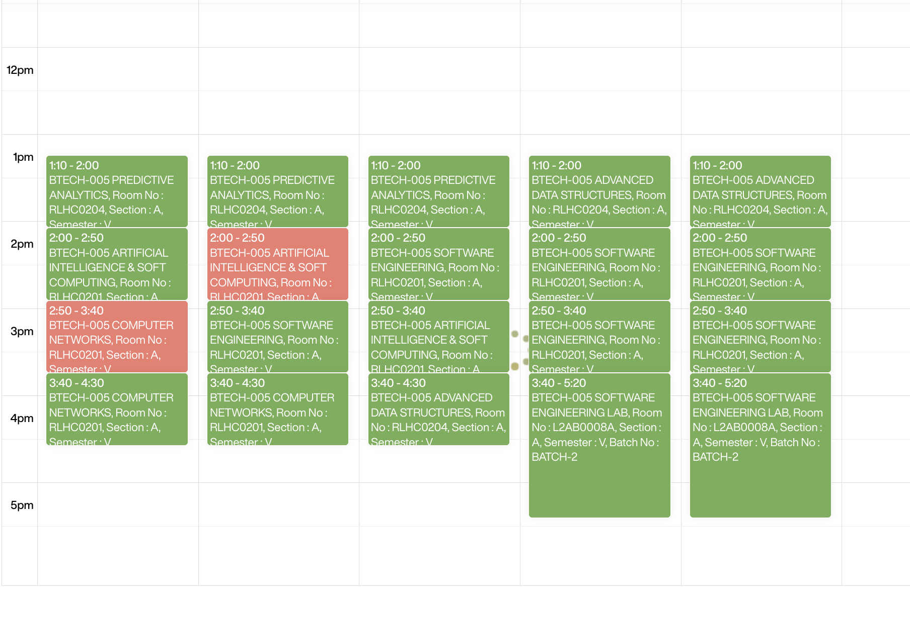
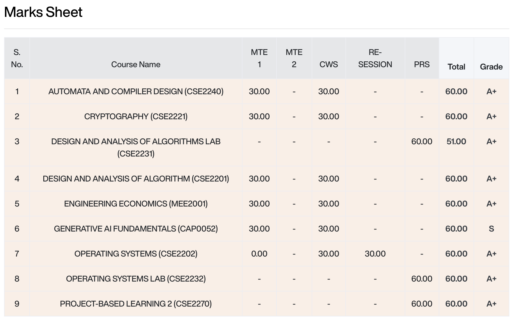

# 🎓 Student Tool

**Student Tool** is a lightweight browser extension designed to enhance the academic experience for students on the Manipal University Jaipur (MUJ) SLCM portal. It automates tedious calculations and provides real-time insights into your academic performance.

---

## ✨ Features

### 📊 Attendance Analytics
Never lose track of your attendance again. The tool injects real-time calculations directly into your attendance table:
- **Classes Required**: Know exactly how many more classes you need to attend to reach that 75% mark.
- **Safe Skips**: Calculate how many upcoming classes you can safely skip without dropping below your target 75% or 90% threshold.

### 📅 Timetable Highlighter
- **Visual Tracking**: Instantly highlights missed classes (Absent) in solid red directly on your calendar timetable, allowing you to track missed lectures at a glance.
- **Background Syncing**: Automatically and quietly syncs attendance data in the background with a beautiful progress indicator.

### 📝 Internal Marks Aggregator
Stop manually adding up your marks!
- **Auto-Sum**: Automatically calculates the total sum of your internal marks across all assessments.
- **Grade Display**: Seamlessly pulls and displays your grades right next to your internal marks for a comprehensive view.

### 📑 Grade Parser
- **Automated Sync**: Parses and stores your grades from the grade portal to be used across the extension.

---

## 🚀 Installation

### For Google Chrome / Brave / Edge
1. https://chromewebstore.google.com/detail/student-tool/knijkmiieojnmmchmmjblnkjbbicicgh

### For Mozilla Firefox
1. https://addons.mozilla.org/en-US/firefox/addon/student-tool/

---

## 🛠️ Tech Stack

- **Vanilla JavaScript**: For lightning-fast execution and no dependencies.
- **Chrome/WebExtension API**: Cross-browser compatibility.
- **CSS3**: For subtle UI injections that feel native to the SLCM portal.

## 🤝 Contributing

Contributions are welcome! If you have ideas for new features or find any bugs, feel free to open an issue or submit a pull request.

1. Fork the Project
2. Create your Feature Branch (`git checkout -b feature/AmazingFeature`)
3. Commit your Changes (`git commit -m 'Add some AmazingFeature'`)
4. Push to the Branch (`git push origin feature/AmazingFeature`)
5. Open a Pull Request

---

## 📜 License

Distributed under the MIT License. See `LICENSE` for more information.

